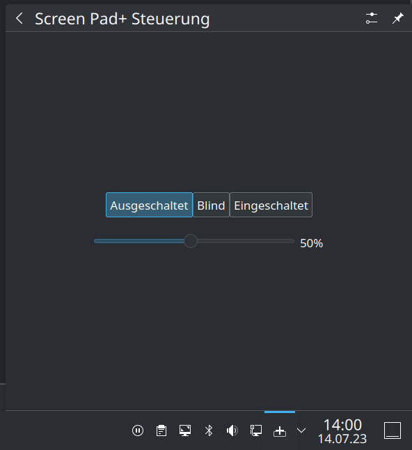

# ASUS Zenbook Screen Pad+ Plasmoid

This little plasmoid lets you control the brightness of your Screen Pad+ conveniently!

## Installation

1. Make sure you installed `asus-wmi-screenpad`: https://github.com/Plippo/asus-wmi-screenpad
2. Copy `99-asus-screenpad-permissions.rules` to `/etc/udev/rules.d/`
3. From the parent directory run `kpackagetool5 -i screen-pad-plus-plasmoid`

**On ArchLinux** you can install the WMI driver from the AUR: https://aur.archlinux.org/packages/asus-wmi-screenpad-dkms-git
(`yay -S aur/asus-wmi-screenpad-dkms-git`)
